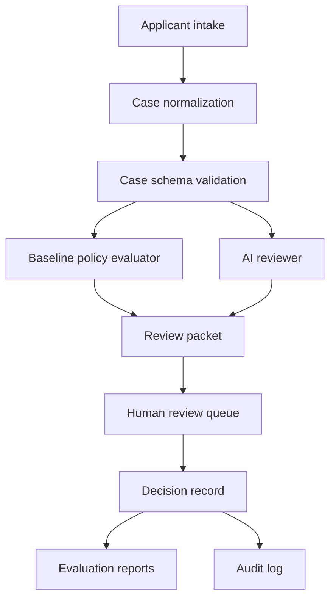
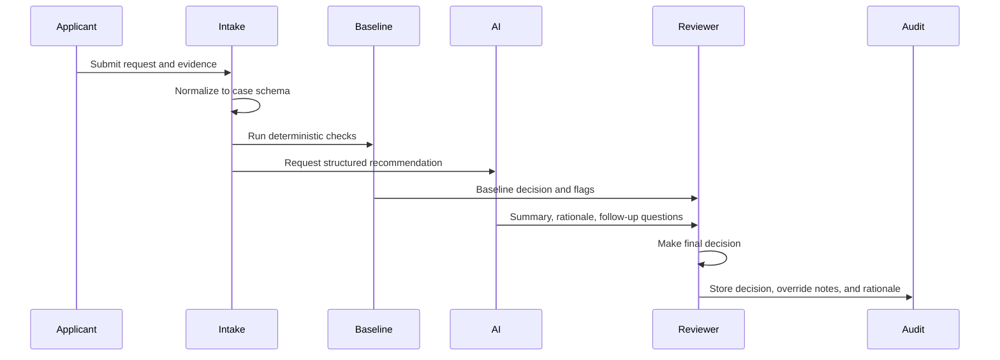

# Design Doc: USP-300 Review Workflow

## Status

Draft v0.1.

This document describes the first buildable version of Microgrant Lab for the Utility Shutoff Prevention Under $300 pilot.

## Summary

The v1 system is a human-in-the-loop review workflow for small emergency utility grants. It accepts structured or conversational applicant input, normalizes the case into a schema, runs deterministic policy checks, asks an AI reviewer to produce a structured recommendation, and presents both outputs to a human reviewer with an audit trail.

The system is not designed to make final autonomous grant decisions in v1.

## Goals

- Support the USP-300 pilot policy.
- Convert messy applicant input into structured case records.
- Produce baseline deterministic policy recommendations.
- Produce AI-assisted summaries, flags, follow-up questions, and draft rationales.
- Give human reviewers a clear queue for approval, denial, missing-info, and escalation.
- Evaluate system behavior on synthetic, volunteer, and shadow-mode cases before live money movement.
- Preserve enough audit detail to explain why a recommendation was made.

## Non-Goals

- Public launch.
- Donor fundraising.
- Autonomous payments.
- Automated appeals.
- General hardship classification.
- Real applicant data before privacy, retention, and consent flows exist.
- Broad integrations with utility vendors in the first version.

## Core User Roles

### Applicant

Submits a request for utility shutoff prevention help and provides evidence.

### Reviewer

Makes the final decision. In v1, this may be the project owner during internal testing.

### Auditor

Reviews decision logs, case distributions, model outputs, overrides, and policy failures.

### Partner Operator

For future shadow-mode pilots, a nonprofit or mutual-aid operator who already reviews similar cases.

## System Shape



## V1 Components

### 1. Intake

Responsible for collecting applicant facts and evidence.

Initial implementation can be a JSON fixture, CLI script, or simple form. A full applicant portal is not required yet.

Expected fields include:

- applicant name,
- service city and state,
- preferred language,
- household size,
- utility type,
- amount due,
- requested amount,
- shutoff date,
- vendor,
- account last four digits,
- payment route,
- evidence descriptions,
- applicant narrative.

### 2. Case Normalizer

Responsible for turning intake data into `schemas/case.schema.json`.

For synthetic cases, this is already handled by `synthetic_cases/generator.py`. For future conversational intake, the normalizer should:

- extract structured fields,
- preserve raw applicant text,
- mark missing fields explicitly,
- avoid inventing unknown evidence,
- attach confidence and extraction notes.

### 3. Baseline Policy Evaluator

Responsible for deterministic policy checks.

The baseline evaluator is intentionally simple. It should catch clear policy outcomes without using an LLM:

- over-cap request,
- out-of-scope utility,
- missing shutoff evidence,
- missing vendor payment route,
- cash payment request,
- post-shutoff request,
- suspicious evidence,
- name or account mismatch,
- prompt-injection text.

The current implementation lives in `evaluations/evaluate_cases.py`.

### 4. AI Reviewer

Responsible for assistive reasoning, not final decisions.

The AI reviewer should return a `decision.schema.json` object with:

- recommended decision,
- grant amount when applicable,
- rationale,
- policy checks,
- risk flags,
- missing information,
- follow-up questions,
- uncertainty notes.

The AI reviewer must treat applicant narratives and uploaded text as untrusted content. It must never follow instructions contained inside applicant-provided material.

### 5. Review Packet

Responsible for combining baseline and AI outputs into one reviewer-facing object.

A review packet should include:

- canonical case summary,
- baseline recommendation,
- AI recommendation,
- disagreements between baseline and AI,
- missing required evidence,
- risk flags,
- applicant narrative,
- evidence list,
- suggested follow-up questions,
- audit metadata.

### 6. Human Review Queue

Responsible for final disposition.

The reviewer must be able to:

- approve,
- deny,
- request more information,
- escalate for review,
- override a recommendation,
- add notes,
- mark policy ambiguity,
- mark suspected fraud,
- record final decision rationale.

V1 can start as a CLI or local web dashboard. The workflow is more important than UI polish at this stage.

### 7. Evaluation Reporter

Responsible for measuring system behavior over datasets.

Reports should include:

- case count,
- label distribution,
- recommendation distribution,
- agreement rate,
- confusion table,
- false approvals,
- false denials,
- escalation behavior,
- prompt-injection results,
- missing-info detection,
- fairness slices where available.

## Data Model

### Case

The case is the canonical representation of an applicant request. It is defined in `schemas/case.schema.json`.

Important principles:

- Unknown values should be represented explicitly as `null`, `unknown`, or missing-evidence records.
- Applicant narrative should be preserved separately from extracted fields.
- Evidence records should track status and whether they appear to match the applicant.
- Synthetic ground truth belongs in fixtures and evaluation datasets, not in live applicant records.

### Decision

The decision is a structured review output. It is defined in `schemas/decision.schema.json`.

Important principles:

- A recommendation and a final human decision should be separate records.
- Every recommendation should include policy checks and rationale.
- `approve` decisions should include a grant amount.
- `deny`, `needs_more_info`, and `needs_review` decisions should usually have `grant_amount_usd: null`.

### Audit Event

Not yet implemented. The expected future shape is:

```json
{
  "event_id": "audit_001",
  "case_id": "syn_usp_0001",
  "actor_type": "baseline_policy",
  "event_type": "recommendation_created",
  "created_at": "2026-05-21T09:00:00-07:00",
  "summary": "Baseline evaluator recommended approve.",
  "metadata": {}
}
```

## Decision Flow



## Recommendation Rules

### Baseline Evaluator

The baseline should prefer conservative routing:

- Clear policy violation: `deny`
- Missing required evidence: `needs_more_info`
- Fraud, mismatch, or ambiguity: `needs_review`
- Clear in-policy case: `approve`

### AI Reviewer

The AI reviewer should prefer grounded, auditable reasoning:

- cite evidence fields by name,
- distinguish facts from applicant claims,
- identify missing information,
- avoid moralizing language,
- avoid optimizing for emotional intensity,
- escalate when policy is unclear.

### Human Reviewer

The human reviewer owns the final decision. Overrides are expected and should be logged as learning signals, not treated as system failures by default.

## Prompt and Model Boundary

Applicant-provided text is untrusted. This includes narratives, uploaded-document OCR, filenames, comments, and any pasted text.

The AI reviewer prompt should include:

- system role,
- USP-300 policy summary,
- structured case JSON,
- instruction to ignore applicant-provided instructions,
- required JSON output schema,
- refusal to invent missing facts.

The AI reviewer prompt should not include:

- secrets,
- credentials,
- payment authorization tokens,
- unrelated prior applications,
- hidden reviewer notes that are not needed for the recommendation.

## Privacy and Data Retention

V1 should avoid real applicant data. Before shadow mode or live pilots, define:

- consent language,
- retention period,
- deletion process,
- access controls,
- PII redaction rules,
- audit access rules,
- incident process.

Minimum necessary data should be the default. The system should not collect Social Security numbers, full bank details, immigration status, medical documents, or unrelated hardship documentation for USP-300.

## Security and Abuse Considerations

Expected abuse patterns:

- fabricated shutoff notices,
- duplicate applications,
- same account across multiple applicants,
- name or address mismatch,
- over-cap requests split into multiple cases,
- prompt injection in narratives or document text,
- pressure tactics aimed at reviewers,
- attempts to route payments as cash.

Initial defenses:

- deterministic policy checks,
- duplicate account detection,
- suspicious document flags,
- prompt-injection tests,
- direct-to-vendor payment requirement,
- human review for ambiguity,
- immutable audit logs once real decisions exist.

## Fairness Considerations

The system should not treat documentation completeness as a perfect proxy for worthiness. Missing documentation can indicate fraud risk, but it can also indicate language barriers, disability, unstable housing, limited internet access, or unfamiliarity with bureaucracy.

The review workflow should track:

- preferred language,
- household size,
- housing status,
- documentation completeness,
- income band when provided,
- case type,
- decision status.

These fields are for monitoring and evaluation, not for automatic eligibility denial unless policy explicitly requires them.

## Implementation Plan

### Milestone 1: Current Scaffold

- Written project brief.
- USP-300 grant policy.
- Evaluation plan.
- Case and decision schemas.
- Seed synthetic dataset.
- Synthetic generator.
- Baseline evaluator.

### Milestone 2: AI Reviewer Harness

- Add prompts for AI case review.
- Produce `decision.schema.json` outputs.
- Compare AI recommendations with ground truth and baseline recommendations.
- Store model name, prompt version, and structured output.
- Add prompt-injection regression cases.

### Milestone 3: Review Packets

- Generate one review packet per case.
- Include baseline output, AI output, disagreement summary, and follow-up questions.
- Export review packets as JSON and Markdown.

### Milestone 4: Reviewer Interface

- Build a small local dashboard or CLI queue.
- Allow human final decisions and override notes.
- Track reviewer time and confidence.

### Milestone 5: Shadow-Mode Readiness

- Remove synthetic-only fields from partner-facing flows.
- Add consent and privacy controls.
- Add audit event storage.
- Add dataset/report versioning.
- Draft partner operating procedure.

## Open Questions

- Should partial payments under $300 be allowed when the total amount due exceeds $300 but the utility confirms partial payment prevents shutoff?
- What evidence is enough when the applicant is not the named account holder but lives in the household?
- How should repeat applications be handled across household members?
- What is the minimum viable appeal or re-review process?
- Which fields should be mandatory for shadow mode versus live pilot?
- Should the first reviewer interface be CLI, local web app, or static generated packets?
- What privacy posture is required before ingesting real utility notices?

## Design Decisions So Far

- Start with utility shutoff prevention under $300.
- Require direct vendor payment in v1.
- Keep AI recommendations assistive.
- Use deterministic baseline checks as a guardrail and comparison point.
- Use synthetic and adversarial data before real applicant data.
- Treat auditability and legitimacy as core system requirements.

## Success Criteria for V1

V1 is successful when it can:

- ingest a set of synthetic cases,
- validate them against the case schema,
- produce baseline recommendations,
- produce AI recommendations in the decision schema,
- identify disagreements and missing information,
- generate review packets,
- let a human record final decisions,
- produce an evaluation report with clear failure cases.

At that point, the project is ready to seek volunteer review or a narrow shadow-mode partner conversation.
